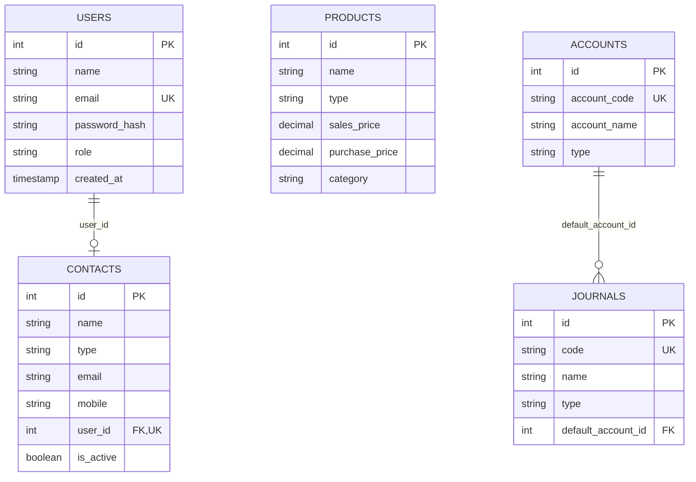
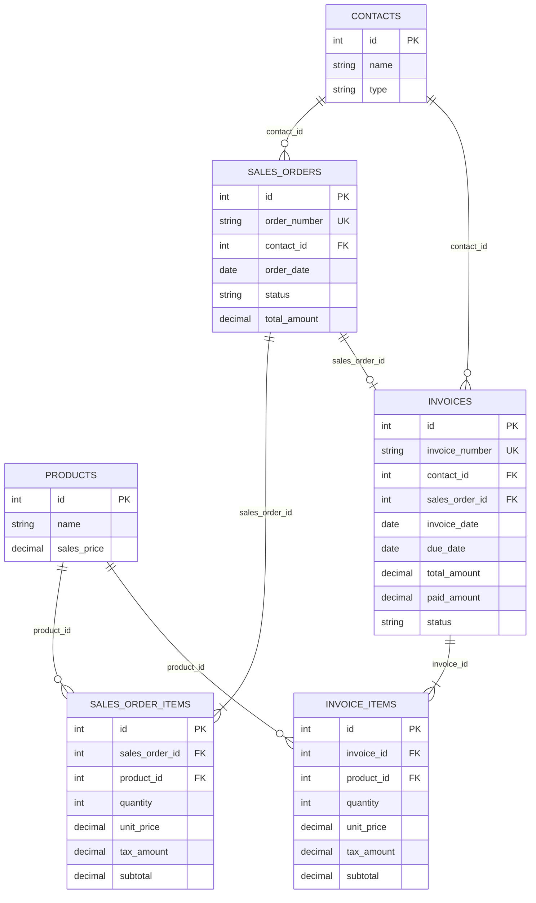
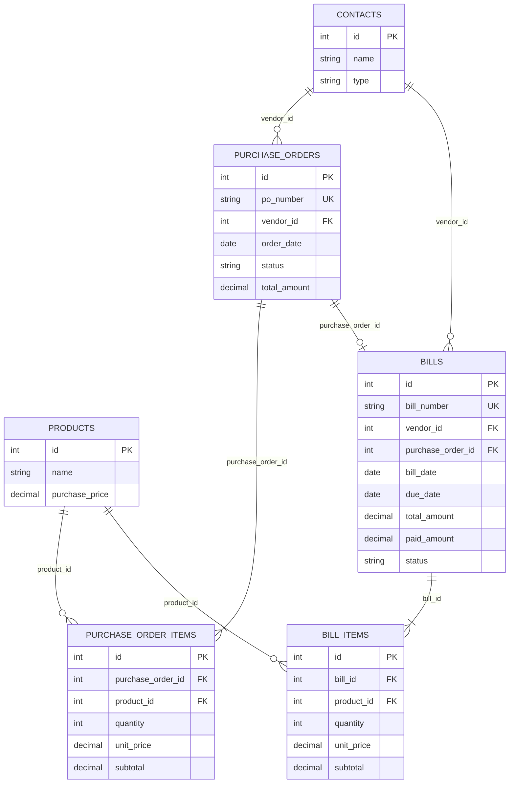
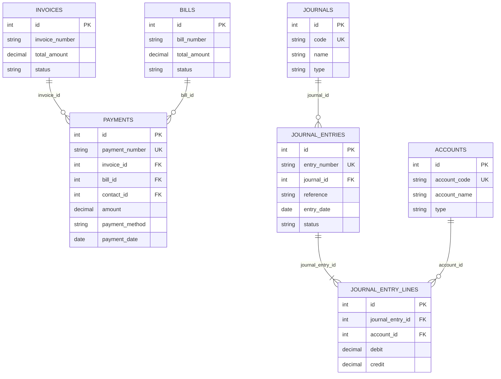
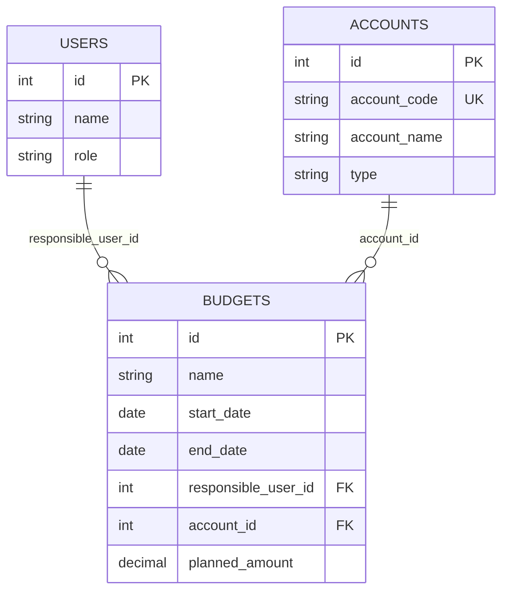

# Database Schema & Modular ER Diagrams — Urban Furniture

To ensure 100% readability and clarity, the database ER diagram is broken down into 5 focused core module diagrams below.

---

## 1. Master Data ERD (Core Entities)

Stores users, customer/vendor contacts, product catalog, chart of accounts, and accounting journals.

---

## 2. Sales & Invoicing Workflow ERD

Manages customer sales orders, line items, customer invoices, and invoice line items.

---

## 3. Purchase & Vendor Bills Workflow ERD

Manages vendor purchase orders, vendor bills, and line item breakdowns.

---

## 4. Payments & Double-Entry Accounting ERD

Manages payments against customer invoices or vendor bills, and links to automated journal entries and ledger lines.

---

## 5. Budgets & Analytical Management ERD

Manages planned budget allocations linked to accounts and responsible users.

