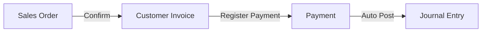
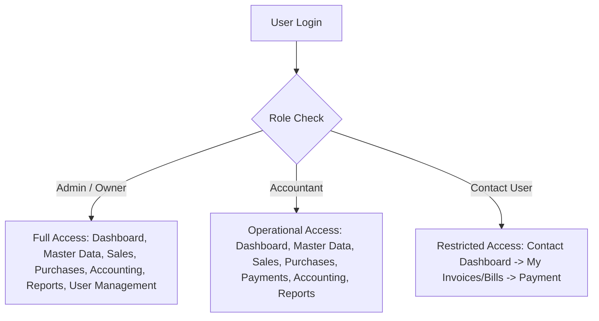

# UI Flow & Screen Structure — Urban Furniture Accounting

## Reference Mockup
The UI layout, screen structures, and user navigation follow the hackathon Excalidraw wireframe reference:
🔗 **[Excalidraw UI Mockup Wireframe](https://app.excalidraw.com/s/65VNwvy7c4X/6ofCsWuwhe)**

---

## Navigation & Layout Architecture

```text
+-----------------------------------------------------------------------------------+
|  Urban Furniture Logo  |  [Dashboard] [Contacts] [Products] [Sales] [Purchases]   |  User Profile (Role) |
|                        |  [Accounting] [Budgets] [Reports]                        |  [ Logout ]          |
+-----------------------------------------------------------------------------------+
|                                                                                   |
|                                    MAIN CONTENT                                   |
|                                  (Dynamic View)                                   |
|                                                                                   |
+-----------------------------------------------------------------------------------+
| Footer: Urban Furniture Accounting System © 2026 | System Status: Active          |
+-----------------------------------------------------------------------------------+
```

---

## 1. Authentication

### 1.1 Login Screen
```text
+----------------------------------------------------+
|                URBAN FURNITURE                      |
|                  Sign In                           |
|                                                    |
| Email Address:                                     |
| [ user@urbanfurniture.com                        ] |
|                                                    |
| Password:                                          |
| [ ******************                            ] |
|                                                    |
| [ Login ]                     [ Forgot Password? ] |
|                                                    |
| Protected by JWT & bcrypt Hashing                  |
+----------------------------------------------------+
```
- **Fields**: Email, Password
- **Actions**: Login, Forgot Password
- **After Successful Login**: Redirection to Role Dashboard (`/dashboard` or `/contact-portal`)

### 1.2 Register Screen
- **Fields**: Name, Email, Password, Confirm Password
- **Action**: Create Account

---

## 2. Dashboard

The Dashboard is the main overview screen after login, displaying real-time financial KPIs and module navigation.

```text
+-----------------------------------------------------------------------------------+
|  DASHBOARD                                                       [ Quick Action + ]|
+-------------------+-------------------+-------------------+-----------------------+
|  TOTAL SALES      |  TOTAL PURCHASES  |  RECEIVABLES      |  NET PROFIT           |
|  ₹1,25,000        |  ₹75,000          |  ₹35,000          |  ₹50,000              |
+-------------------+-------------------+-------------------+-----------------------+
|  PAYABLES         |  CASH / BANK BAL  |  ACTIVE BUDGETS   |  PENDING INVOICES     |
|  ₹45,000          |  ₹1,75,000        |  ₹1,00,000        |  5 Pending            |
+-------------------+-------------------+-------------------+-----------------------+
|                                                                                   |
|  [ Recent Sales Orders ]                          [ Cash & Bank Balance ]         |
|  - SO-001 | Nimesh  | ₹11,800 | Paid            - Cash Account : ₹25,000       |
|  - SO-002 | Acme Co | ₹23,600 | Pending         - HDFC Bank    : ₹1,50,000     |
|                                                                                   |
+-----------------------------------------------------------------------------------+
```

---

## 3. Master Data

Master Data contains the basic configuration required before recording business transactions.

### 3.1 Contacts

#### Contact List
- **Displays**: Name, Type, Email, Mobile, Status
- **Actions**: Add Contact, Edit, Archive, View

```text
+-----------------------------------------------------------------------------------+
| Contacts                                                     [ + Add New Contact ]|
| Search: [ Search by name or email...           ]  Filter: [ All | Customers | Vendors ]|
+------+----------------------+------------+---------------+----------------+-------+
| ID   | Name                 | Type       | Mobile        | Email          | Action|
+------+----------------------+------------+---------------+----------------+-------+
| C-01 | Nimesh Kumar         | Customer   | +91 9876543210| nimesh@mail.com| Edit  |
| V-01 | Rahul Wood Suppliers | Vendor     | +91 9123456789| rahul@wood.com | Edit  |
+------+----------------------+------------+---------------+----------------+-------+
```

#### Contact Form
- **Fields**: Name, Type (`Customer` / `Vendor` / `Both`), Email, Mobile, Address, City, State, Pincode, Profile Image.
- **Link**: A contact can be associated with a `Contact User` login account.

---

### 3.2 Products

#### Product List
- **Displays**: Product Name, Type, Category, Sales Price, Cost, Status
- **Actions**: Add Product, Edit, Archive, View

#### Product Form
- **Fields**: Product Name, Type (`Goods` / `Service` / `Combo`), Sales Price, Purchase Price, Category.

---

### 3.3 Chart of Accounts

#### Account List
- **Displays**: Account Name, Account Type, Status
- **Account Types**: `Asset`, `Liability`, `Expense`, `Income`, `Capital`

#### Account Form
- **Fields**: Account Name, Type, Description

---

### 3.4 Journals

#### Journal List
- **Displays**: Journal Name, Journal Type, Default Account, Status
- **Journal Types**: `Sales`, `Purchase`, `Bank`, `Cash`

#### Journal Form
- **Fields**: Journal Name, Type, Default Accounts

---

### 3.5 Analytic Accounts & Budget

#### Analytic Account
- **Fields**: Name, Type (`Income` / `Expense`)

#### Budget
- **Fields**: Budget Name, Period (Start/End Date), Responsible Person, Analytic Account, Planned Amount
- **Displays**: Planned Amount, Actual Amount, Remaining / Variance Amount

---

## 4. Sales Workflow



### 4.1 Sales Order List
- **Displays**: Order Number, Customer, Date, Total, Status
- **Actions**: Create Sales Order, View, Edit

### 4.2 Create Sales Order
- **Fields**: Customer, Product, Quantity, Unit Price, Tax (GST)
- **Calculation**:
  $$\text{Subtotal} = \text{Quantity} \times \text{Unit Price}$$
  $$\text{Total} = \text{Subtotal} + \text{Tax}$$
- **Workflow**: Confirmation transitions Sales Order $\rightarrow$ Customer Invoice.

### 4.3 Customer Invoice
```text
+-----------------------------------------------------------------------------------+
| INVOICE: #INV-2026-001                                      Status: [   PAID   ]  |
| Customer: Nimesh Kumar                                      Date: 05-Sep-2026     |
+-----------------------------------------------------------------------------------+
| Item                     | Qty   | Unit Price  | Tax (18%)   | Subtotal           |
+--------------------------+-------+-------------+-------------+--------------------+
| Executive Office Chair   | 5     | ₹2,000      | ₹1,800      | ₹10,000            |
+--------------------------+-------+-------------+-------------+--------------------+
|                                                  Subtotal    : ₹10,000            |
|                                                  Tax (GST)   : ₹1,800             |
|                                                  Total Amount: ₹11,800            |
|                                                  Paid Amount : ₹11,800            |
|                                                  Balance Due : ₹0                 |
+-----------------------------------------------------------------------------------+
| [ Download PDF ]                                            [ Register Payment ]  |
+-----------------------------------------------------------------------------------+
```
- **Actions**: Confirm Invoice, Register Payment

### 4.4 Customer Payment
- **Fields**: Invoice ID, Payment Amount, Payment Method (`Cash` / `Bank`), Payment Date, Reference
- **Status Updates**: `Unpaid` $\rightarrow$ `Partially Paid` $\rightarrow$ `Paid`
- **Automation**: Triggers automated Journal Entry (`Debit Cash/Bank`, `Credit Sales/Tax`).

---

## 5. Purchases Workflow

### 5.1 Purchase Order List
- **Displays**: Order Number, Vendor, Date, Total, Status
- **Actions**: Create Purchase Order, View, Edit

### 5.2 Create Purchase Order
- **Fields**: Vendor, Product, Quantity, Unit Price
- **Calculation**: $\text{Total} = \text{Quantity} \times \text{Unit Price}$
- **Workflow**: Confirmation transitions Purchase Order $\rightarrow$ Vendor Bill upon goods receipt.

### 5.3 Vendor Bill
- **Displays**: Bill Number, Vendor, Invoice Date, Due Date, Products, Quantity, Amount, Payment Status
- **Actions**: Confirm Bill, Register Payment

### 5.4 Vendor Payment
- **Fields**: Vendor Bill ID, Payment Amount, Payment Method (`Cash` / `Bank`), Payment Date
- **Automation**: Payment $\rightarrow$ Auto Journal Entry $\rightarrow$ Bill Status Updated (`Unpaid`, `Partially Paid`, `Paid`).

---

## 6. Journal Entries (Double-Entry Validation)

The Journal Entry screen displays actual accounting records generated from business transactions.

```text
+-----------------------------------------------------------------------------------+
| JOURNAL ENTRY: #JE-2026-089                                 Date: 05-Sep-2026     |
| Reference: Customer Payment #INV-2026-001                   Journal: Bank Journal |
+-----------------------------------------------------------------------------------+
| Account Name                 | Account Type  | Debit (₹)      | Credit (₹)        |
+------------------------------+---------------+----------------+-------------------+
| HDFC Bank Account            | Asset         | 11,800.00      | 0.00              |
| Sales Income Account         | Income        | 0.00           | 10,000.00         |
| Output GST Account           | Liability     | 0.00           | 1,800.00          |
+------------------------------+---------------+----------------+-------------------+
| TOTAL                        |               | ₹11,800.00     | ₹11,800.00        |
+-----------------------------------------------------------------------------------+
| Validation Status: [ BALANCED ] (Total Debit == Total Credit)                    |
+-----------------------------------------------------------------------------------+
```

- **Validation Rule**:
  $$\text{Total Debit} = \text{Total Credit}$$
  If values are unequal, entry submission is blocked.

---

## 7. Financial Reports

### 7.1 Balance Sheet (`/reports/balance-sheet`)
```text
+-----------------------------------------------------------------------------------+
| BALANCE SHEET                                               As of: 05-Sep-2026    |
+------------------------------------+----------------------------------------------+
| ASSETS                             | LIABILITIES & CAPITAL                        |
+------------------------------------+----------------------------------------------+
| Current Assets:                    | Current Liabilities:                         |
|   Cash Account       : ₹25,000     |   Creditors/Payables : ₹45,000             |
|   HDFC Bank          : ₹1,50,000   |   Tax Liabilities    : ₹18,000             |
| Accounts Receivable  : ₹35,000     | Capital & Equity:                            |
| Fixed Assets         : ₹2,90,000   |   Owner Capital      : ₹4,37,000           |
+------------------------------------+----------------------------------------------+
| TOTAL ASSETS         : ₹5,00,000   | TOTAL LIABILITIES & EQUITY: ₹5,00,000        |
+------------------------------------+----------------------------------------------+
| Accounting Check: Assets = Liabilities + Capital [ EQUAL & BALANCED ]            |
+-----------------------------------------------------------------------------------+
```

### 7.2 Profit & Loss (`/reports/profit-loss`)
$$\text{Net Profit} = \text{Sales Income} - (\text{Purchases} + \text{Expenses})$$

### 7.3 Budget Report (`/reports/budget`)
- Displays: Budget Name, Planned Amount, Actual Amount, Remaining / Variance Amount

---

## 8. Role-Based User Flows



> **Security Rule**: Contact Users are blocked from accessing other contacts' invoices, company-wide financial reports, or administrative master data (`403 Forbidden`).

---

## 9. Screen Relationship & Navigation Tree

```text
Dashboard
├── Master Data
│   ├── Contacts
│   ├── Products
│   ├── Chart of Accounts
│   ├── Journals
│   └── Budgets
│
├── Sales
│   ├── Sales Orders
│   ├── Customer Invoices
│   └── Payments
│
├── Purchases
│   ├── Purchase Orders
│   ├── Vendor Bills
│   └── Payments
│
├── Accounting
│   └── Journal Entries
│
└── Reports
    ├── Balance Sheet
    ├── Profit & Loss
    └── Budget Report
```

---

## 10. Core End-to-End Business Flow Summary

```text
Master Data Setup
       │
       ▼
Sales / Purchase Order
       │
       ▼
Customer Invoice / Vendor Bill
       │
       ▼
Payment Registration
       │
       ▼
Automated Journal Entry (Debit == Credit)
       │
       ▼
Financial Reports (P&L & Balance Sheet)
```
